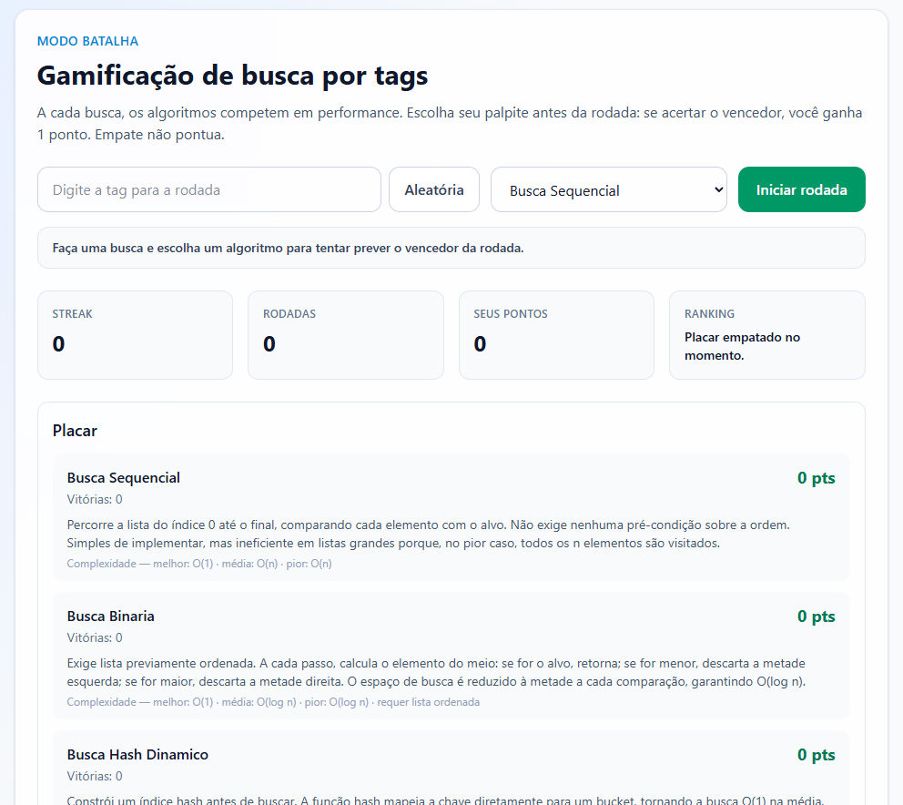
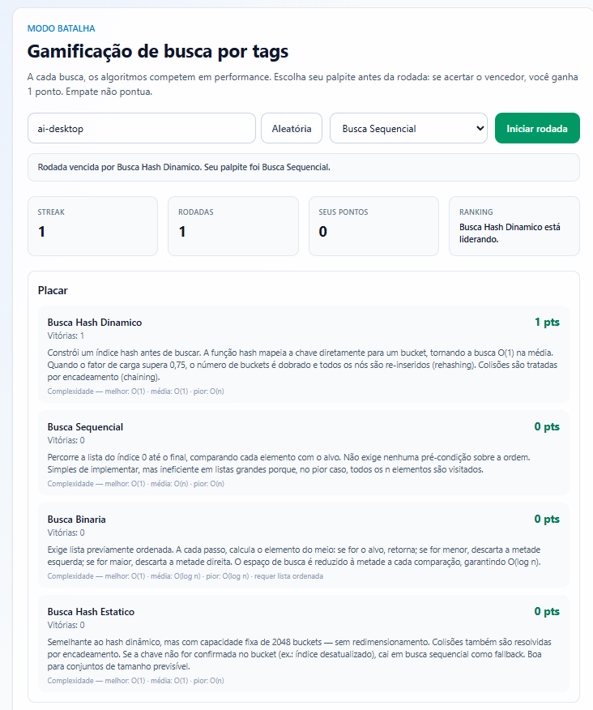
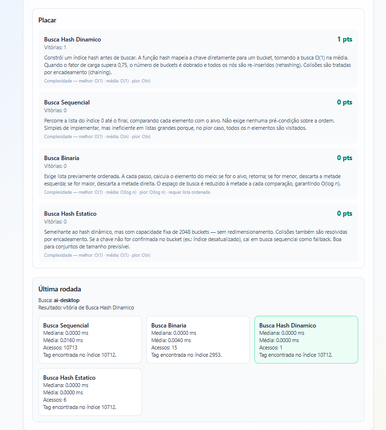
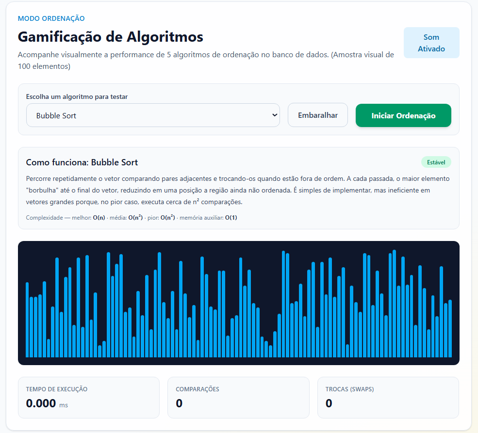
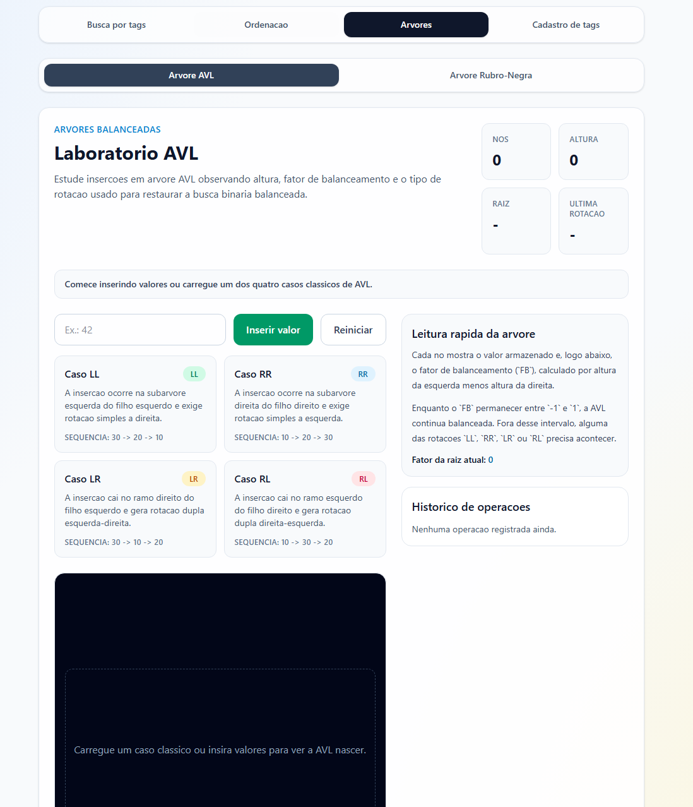
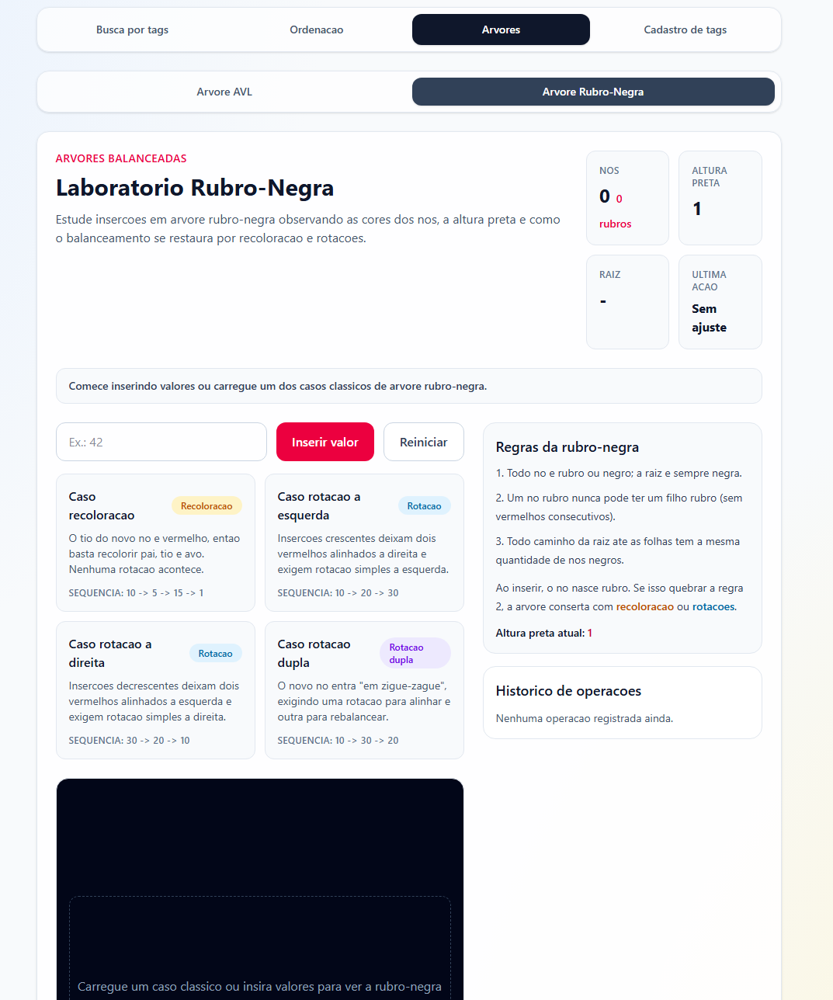
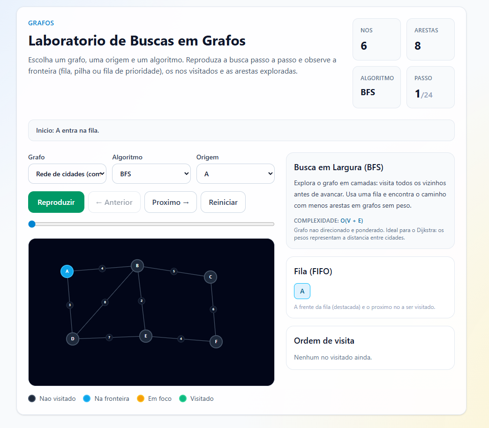
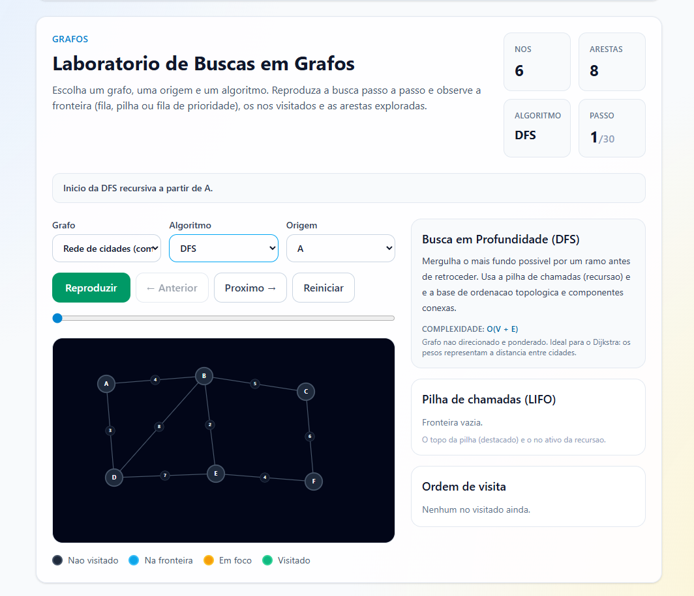

# Final_Arena

Numero da Lista: 1<br>
Conteudo da Disciplina: Algoritmos de Busca<br>
URL de apresentação do trabalho: https://youtu.be/uLZmrvCeF6U<br>

## Alunos
|Matricula | Aluno |
| -- | -- |
| 23/1027159 | Lucas Alves Oliveira dos Santos |
| 23/1035446 | Lucas Monteiro Freitas |

## Sobre
Este projeto apresenta uma aplicacao gamificada para estudar o comportamento de quatro algoritmos de busca em cenarios praticos.

O usuario digita uma tag, escolhe qual algoritmo acredita que sera o vencedor da rodada e inicia a batalha. Em seguida, todos os algoritmos sao executados e comparados por desempenho. O sistema mostra o vencedor e atualiza pontuacao, streak e ranking.

O mesmo ambiente tambem inclui um visualizador de ordenacao e dois laboratorios interativos de arvores balanceadas para estudo de insercoes, rotacoes e propriedades de balanceamento.

Algoritmos abordados:
- Busca Sequencial
- Busca Binaria
- Busca Hash Dinamico
- Busca Hash Estatico

Algoritmos de ordenação presentes no mesmo repositório:
- Bubble Sort
- Insertion Sort
- Merge Sort
- Quick Sort
- Heap Sort

O visualizador de ordenação está implementado em `trabalho1_EDA2/src/components/SortingVisualizer.tsx`, com animação das operações, contagem de comparações e trocas e medição de tempo.

Algoritmos de arvores presentes no mesmo repositorio:
- Arvore AVL
- Arvore Rubro-Negra

Os laboratorios de arvores estao implementados em `trabalho1_EDA2/src/components/AvlStudyLab.tsx` e `trabalho1_EDA2/src/components/RedBlackStudyLab.tsx`, com insercao interativa de valores, presets para casos classicos e visualizacao do rebalanceamento.

Na AVL, o usuario acompanha altura, fator de balanceamento e os quatro casos classicos de rotacao: LL, RR, LR e RL.

Na Rubro-Negra, o usuario acompanha cores dos nos, altura preta, recoloracoes e rotacoes usadas para restaurar as propriedades da estrutura.

Algoritmos de grafos presentes no mesmo repositorio:
- BFS — Busca em Largura
- DFS — Busca em Profundidade
- Dijkstra — Menor caminho com pesos

O laboratorio de grafos esta implementado em `trabalho1_EDA2/src/components/GraphStudyLab.tsx`, com reproducao passo a passo da execucao de cada algoritmo, legenda de estados dos nos (nao visitado, fronteira, em foco, visitado) e exibicao das distancias conhecidas no Dijkstra.

Sao oferecidos tres grafos de exemplo:
- **Rede de cidades (com peso)**: grafo nao direcionado e ponderado, ideal para Dijkstra.
- **Malha sem peso**: grafo nao direcionado organizado em grade, bom para visualizar camadas do BFS e mergulhos do DFS.
- **Grafo direcionado**: arestas com sentido e pesos, mostrando como BFS e DFS respeitam a direcao das setas.

## Screenshots






### Árvore



### grafo



## Instalacao
Linguagem: TypeScript e JavaScript<br>
Framework: React + Vite<br>

Pre-requisitos:
- Node.js 18+
- npm 9+

Comandos:

```bash
cd trabalho1_EDA2
npm install
```

## Uso
Para executar o frontend em desenvolvimento:

```bash
cd trabalho1_EDA2
npm run dev
```

Depois, abra a URL informada no terminal (padrao do Vite: `http://localhost:5173`).

Passo a passo de uso na interface:
1. Digite uma tag no campo de busca (ou use o botao de tag aleatoria).
2. Selecione o algoritmo do seu palpite.
3. Clique em "Iniciar rodada".
4. Analise o vencedor, os tempos e o placar.
5. Acesse a aba "Ordenacao" para visualizar os algoritmos de ordenacao.
6. Acesse a aba "Arvores" para estudar os laboratorios AVL e Rubro-Negra.
7. Acesse a aba "Grafos" para estudar BFS, DFS e Dijkstra com animacao passo a passo.

Para executar o benchmark da busca sequencial via CLI:

```bash
cd trabalho1_EDA2
npm run busca:sequencial
```

## Outros
- Criterio de vitoria por rodada: menor tempo mediano; em empate, menor tempo medio; em novo empate, menor numero de acessos.
- O projeto possui cadastro local de tags para montar cenarios personalizados de teste.
- A CLI atual mede apenas busca sequencial; comparacao CLI dos 4 algoritmos pode ser adicionada como evolucao futura.
